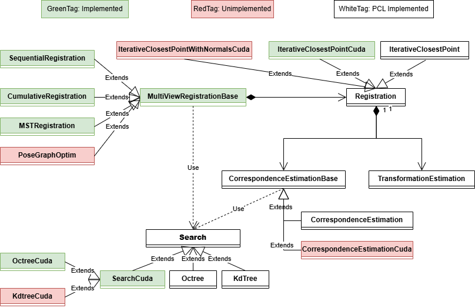
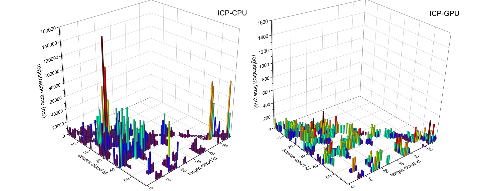

# GPU-accelerated Multi-View pointcloud Fine Registration library (Alpha)

* [中文版](./README_CN.md)

**MVFR-GPU** is a multi-view point cloud fine registration algorithm library, which is **PCL interface compatible** and **supports GPU acceleration**.

## Contents

1. [Introduction](#1-introduction)
2. [Environment](#2-environment)
3. [Experiment](#3-experiments)
4. [Future](#4-future)

## 1. Introduction

**Multi-view point cloud registration** is the basic task of point cloud processing, which needs to transform the local point clouds obtained from multiple views into a unified coordinate system. It's a key step in surface reconstruction, widely used in autonomous driving, AR/VR and other fields. 

Several computation involved in PointCloud Registration, such as **nearest neighborhood search**, **correspondence filter**, **point cloud transformation**, usually need to perform the same processing on the ***points*** in cloud. And these operations are easily implemented in parallel with the GPU, thus greatly improving the algorithm speed. However, the widely used **point cloud processing algorithm library [PCL](https://pointclouds.org/ "PCL website homepage")** only provides GPU acceleration support for [some algorithms](https://github.com/PointCloudLibrary/pcl/tree/master/gpu "PCL GPU module"), and does not realize GPU acceleration for point cloud registration. Therefore, **MVFR-GPU** expects to ***realize GPU acceleration of point cloud registration algorithm with PCL interface compatible***.

## 2. Environment

At present, MVFR-GPU is being tested on **windows** with **C++20** standard, and the details is following:

- Windows10
- Visual Studio 2022 [c++20]
- CUDA 12.6
- Eigen 3.4.0
- boost 1.86.0 [assert, preprocessor, graph]
- PCL 1.14.1 [cuda, vtk]

## 3. Experiments

### 3.1 ICPCuda experiment

Compare **ICP-GPU** with **ICP-CPU**(PCL Implementation) based on [3DMatch](https://3dmatch.cs.princeton.edu/#geometric-registration-benchmark "3DMatch Geometric Registration Benchmark"), see [ICPCuda.cpp](./examples/ICPCuda.cpp "ICPCuda Test program") for experiment code. And the comparison results of the registration time are shown in the figure below (for more detailed experimental data, see [ICP-CPU.csv](./docs/ICP-CPU.csv "ICP-CPU record file") and [ICP-GPU.csv](./docs/ICP-GPU.csv "ICP-GPU record file")):

**note:** The range of the z-axis is different between the two figures.

To repeat this experiment, please configure the 3DMatch sub-dataset according to the following structure (using **7-scenes-redkitchen** as an example):

📦7-scenes-redkitchen 
 ┣ 📂data 
 ┃ ┣ 📜cloud_bin_0.ply 
 ┃ ┣ 📜cloud_bin_1.ply 
 ┃ ┣ 📜... 
 ┃ ┣ 📜cloud_bin_59.ply 
 ┣ 📜gt.info 
 ┗ 📜gt.log 

And execute the ICPCuda executable with appropriate command-line options: `./ICPCuda.exe -d DATASET_PATH`.

### 3.2 MSTRegistration experiment

**TODO**

## 4. Future

The current implementation of MVFR-GPU is as follows:

- [X] OctreeCuda
- [ ] KdtreeCuda
- [X] IterativeCloestPointCuda
- [ ] IterativeCloestPointWithNormalsCuda
- [ ] SequentialRegistration
- [ ] CumulativeRegistration
- [X] MSTRegistration
- [ ] PoseGraphOptim

other features will be implemented in the future.
