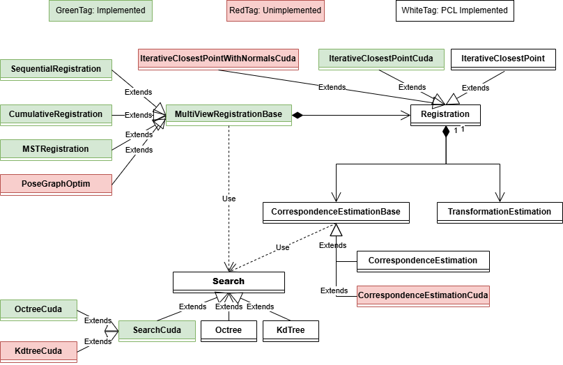

# 基于GPU加速的多视图点云精配准算法库（测试版）

* [English Version](./README.md)

**MVFR-GPU** 是一个**PCL接口兼容**并支持**GPU加速**的多视图点云精配准算法库。

## 目录

1. [介绍](#1-介绍)
2. [环境](#2-运行环境)
3. [实验](#3-实验)
4. [展望](#4-展望)

## 1. 介绍

**多视图点云配准**是点云处理的基本任务，需要将多个视角获取的局部点云变换至统一的坐标系下，是表面重建的一项关键步骤，在自动驾驶、增强现实/虚拟现实等领域应用广泛。 
配准过程中涉及到的多个环节（如：近邻点搜索、对应关系筛选、点云空间变换等）通常需要对点云内的数据单元执行相同的操作（***这些操作很容易通过GPU并行实现，从而大幅提高算法的执行速度***）。 然而目前广泛使用的开源点云处理算法库[PCL](https://pointclouds.org/ "PCL网站主页")仅对[部分算法](https://github.com/PointCloudLibrary/pcl/tree/master/gpu "PCL GPU模块")提供了GPU加速支持，未实现点云配准的GPU加速。因此本库期望保证**PCL接口兼容**的同时实现**点云配准算法的GPU加速**。

## 2. 运行环境

目前算法库在**windows**平台以**C++20**标准测试，以下是详细的运行环境：

- Windows10
- Visual Studio 2022 [c++20]
- CUDA 12.6
- Eigen 3.4.0
- boost 1.86.0 [assert, preprocessor, graph]
- PCL 1.14.1 [cuda, vtk]
  
其中涉及到的第三方库(Eigen, boost, PCL等)可采用[vcpkg 清单模式](https://learn.microsoft.com/zh-cn/vcpkg/get_started/get-started-msbuild?pivots=shell-powershell "vcpkg包安装流程")安装(可以跳过[第二步](https://learn.microsoft.com/zh-cn/vcpkg/get_started/get-started-msbuild?pivots=shell-powershell#2---set-up-the-visual-studio-project "配置vcpkg清单文件")，使用仓库内提供的vcpkg清单文件)。

## 3. 实验

### 3.1 ICPCuda实验

基于[3DMatch配准数据集](https://3dmatch.cs.princeton.edu/#geometric-registration-benchmark "3DMatch Geometric Registration Benchmark")展开**ICP-CPU**(PCL实现)与**ICP-GPU**的配准对比实验，实验代码见[ICPCuda.cpp](./examples/ICPCuda.cpp "ICPCuda Test program")。两者的配准时间对比结果如下图所示(更详细的实验数据见[ICP-CPU.csv](./docs/ICP-CPU.csv "ICP-CPU record file")和[ICP-GPU.csv](./docs/ICP-GPU.csv "ICP-GPU record file"))：

**注意：** 两图z轴的范围不同

若要重复该实验请按以下结构配置3DMatch子数据集(以**7-scenes-redkitchen**为例)：

📦7-scenes-redkitchen 
 ┣ 📂data 
 ┃ ┣ 📜cloud_bin_0.ply 
 ┃ ┣ 📜cloud_bin_1.ply 
 ┃ ┣ 📜... 
 ┃ ┣ 📜cloud_bin_59.ply 
 ┣ 📜gt.info 
 ┗ 📜gt.log 

并结合恰当的命令行参数执行**ICPCuda**可执行文件：`./ICPCuda.exe -d DATASET_PATH`。

### 3.2 MSTRegistration 实验

**TODO**

## 4. 展望

目前配准库的实现情况如下:

- [X] OctreeCuda
- [ ] KdtreeCuda
- [X] IterativeCloestPointCuda
- [ ] IterativeCloestPointWithNormalsCuda
- [ ] SequentialRegistration
- [ ] CumulativeRegistration
- [X] MSTRegistration
- [ ] PoseGraphOptim

未实现的功能将被补全...
